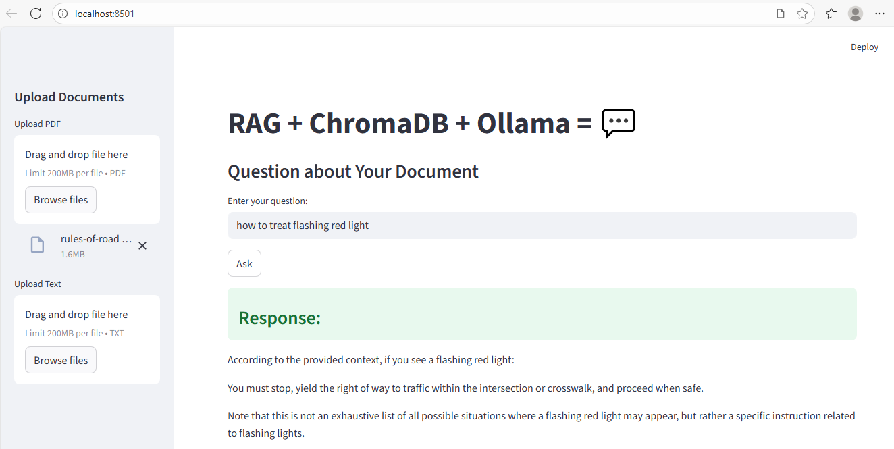

# RAG + ChromaDB + Ollama

This project implements a local Retrieval-Augmented Generation (RAG) pipeline using Streamlit, ChromaDB, and a locally hosted Ollama (LLaMA 3) model. It allows users to upload documents, store them as embeddings, and query them through an interactive chat interface.

### Components

- LLM Client (Ollama)
   - Connects to a local Ollama server (llama3) through an OpenAI-compatible API.
   - Used to generate responses constrained to document context.

- ChromaDB Vector Store
   - Stores and retrieves embeddings of document chunks.
   - Uses the all-MiniLM-L6-v2 SentenceTransformer model for embeddings.
   - Ensures previously uploaded chunks are not duplicated.

- Document Processing
   - PDFs: Extracts text via PyPDF2, normalizes, chunks, and stores in ChromaDB.
   - Text Files: Reads content, normalizes, chunks, and stores in ChromaDB.
   - Chunking: Splits text into manageable segments with configurable length (max_len) and overlap.

- Query Handling
   - Retrieves top relevant chunks from ChromaDB for a user query.
   - Constructs a prompt with:
      - System message (instructions for the LLM).
      - User question.
      - Retrieved context.
   - Sends prompt to Ollama for a context-aware response.

- Streamlit UI
   - Sidebar for file uploads (PDF/TXT).
   - Displays number of new chunks added after upload.
   - Input box for user questions.
   - Shows AI-generated responses based strictly on document context.

### Features
   - Local-first design: no external APIs required.
   - Handles multiple document uploads.
   - Prevents duplicate storage of chunks.
   - Provides transparent view of retrieved context (via console print).
   - Enforces context-only responses—no hallucination or external knowledge.

### Setup Instructions
1. Install Ollama from https://ollama.com/download
2. ollama pull llama3.2 (ollama cp llama3.2 llama3 && ollama serve)
3. git clone https://github.com/nnnpsk/rag-chromadb.git
4. pip install -r requirements.txt
5. streamlit run rag.py

6. Upload a PDF/TXT files --> Split into chunks --> Embeddings stored in local chromadb
7. Ask a question about the document uploaded --> retrieves most relavant chunks --> passes to LLM --> generates answer --> shown in streamlit UI.

   

   
